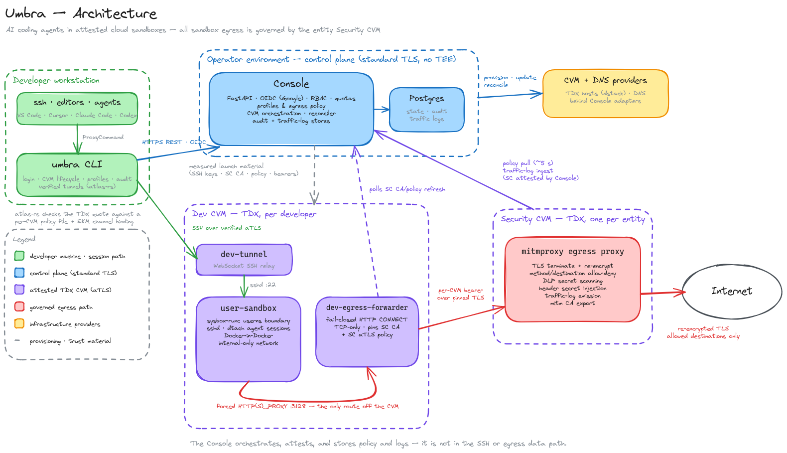

# Umbra

AI agents need a full environment with full machine access, and they need to be locked down. Umbra runs the agent in an attested confidential VM (CVM). The box is a real computer: workspace, packages, Docker, sudo. What happens inside is not inspected. Outbound traffic is governed.

Run a standalone agent in a CVM that is attested and has an identity. Secrets are injected at the proxy, never stored on the machine. The network is bounded.

> Pre-1.0. Interfaces and deployment requirements can change between minor releases. Only the latest release is supported. [Versioning](docs/versioning.md).

## Architecture

A CVM is a confidential VM: a virtual machine the hardware can attest. It runs in a TEE (trusted execution environment). Umbra uses Intel TDX.

The TEE is why you do not have to trust the operator. Guest memory is confidential; the host cannot read or rewrite it. The TEE also makes the VM verifiable. Hardware produces a quote of what booted: firmware, OS, compose, launch bindings such as the developer's SSH keys and the Security CVM's identity. Connections to a CVM use aTLS: TLS with that quote in the handshake, checked against a local policy and bound to the session. The same mechanism can verify what the agent does. Today Umbra attests the box, not the agent's files or commands after boot.



Diagram source: [architecture.excalidraw](docs/assets/architecture.excalidraw).

| Module | Path | Role |
| --- | --- | --- |
| CLI | `cli/` | Auth, CVM lifecycle, aTLS tunnels, SSH/editor/agent sessions. |
| Console | `console/` | Auth, policy, orchestration, audit. |
| Dev CVM | `cvms/dev/` | Per-developer TDX sandbox. Fail-closed egress. |
| Security CVM | `cvms/security/` | Per-entity egress proxy: policy, DLP, credential injection, traffic logs. |

The Console is ordinary HTTPS. The Dev and Security CVMs are the confidential-compute boundary.

See the [v0 plan](docs/v0_plan.md), [supply-chain threat model](docs/supply-chain-threat-model.md), and [specs](docs/specs/).

## Try the CLI

Once an operator has provisioned your account and assigned a profile:

Build from source until the first approved release is published. After that, use the [SLSA-verified installer](docs/quick-start.md#install). Then:

```bash
umbra auth login https://console.example.com
umbra cvm launch
umbra ssh
```

Keys, editors, Claude Code, and Codex: [quick start](docs/quick-start.md).

## Self-host

A live deployment needs a Linux host, Postgres, OIDC, DNS, a TDX CVM provider, and a container registry.

- [Environments](docs/environments.md)
- [Operator setup](docs/operator-setup.md)
- [Deployment](docs/production-deploy.md)
- [CI/CD](docs/ci-cd.md)

Tracked environment files are examples. Put secrets in the gitignored layers from the setup guide.

## Develop

```bash
make build
make check
make test
```

These run locally. You do not need maintainer cloud credentials.

Module READMEs: [CLI](cli/README.md), [Console](console/README.md), [Dev CVM](cvms/dev/README.md), [Security CVM](cvms/security/README.md).

Specs are the contract. Update spec, implementation, tests, and the affected README together. See [CONTRIBUTING.md](CONTRIBUTING.md) and [AGENTS.md](AGENTS.md).

## Security boundary

Umbra governs traffic from processes inside the Dev CVM. Your laptop and provider-hosted editors can still reach the network on their own. Run the agent or shell inside the Dev CVM when you need Security CVM enforcement.

Do not use an attestation bypass in production or release verification. Temporary Security CVM image-policy deviation: [docs/sc-policy-check-disabled.md](docs/sc-policy-check-disabled.md).

Report vulnerabilities privately: [SECURITY.md](SECURITY.md).

## Project

- [Roadmap](ROADMAP.md)
- [Changelog](CHANGELOG.md)
- [Versioning](docs/versioning.md)
- [Governance](GOVERNANCE.md)
- [Support](SUPPORT.md)
- [Code of conduct](CODE_OF_CONDUCT.md)
- [Trademarks](TRADEMARKS.md)
- [Authors](AUTHORS.md)

[License](LICENSE.txt).
