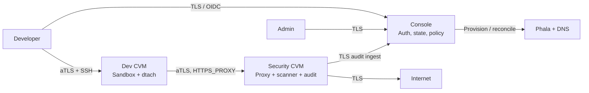
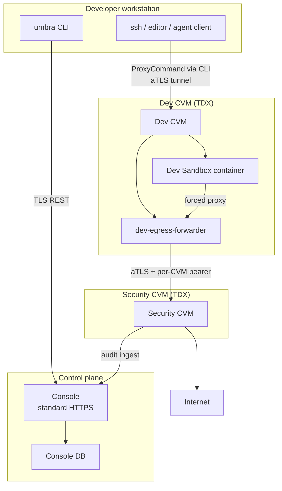

# Umbra Architecture

> This document is the high-level, full-system overview: product shape, component boundaries, trust boundaries, and end-to-end flows. Component implementation contracts live under [`docs/specs/`](specs/).

## Product Goal

Umbra gives developers a cloud sandbox where AI agents can run code on their behalf without giving those agents unconstrained network and secret access. The developer works through the `umbra` CLI. Code runs inside a developer-owned Dev CVM. All outbound traffic is forced through the entity's Security CVM, where policy enforcement, secret scanning, and audit logging happen.

The v0 platform has four components:

| Component | Location | Role |
| --- | --- | --- |
| CLI | Developer machine | Developer and admin client: login, sessions, tunnels, keys, CVMs, profiles, Security CVM, audit. The CLI is also the operator surface — there is no separate admin frontend in v0. |
| Console | Standard HTTPS server | Authentication, authorization, multi-tenant resource state, provisioning orchestration, policy management, control-plane audit + egress traffic-log ingest. |
| Dev CVM | TEE, one or more per developer | Runs the Dev Sandbox container, SSH endpoint, persistent agent sessions, and enforced proxy configuration. |
| Security CVM | TEE, one per entity | Enforces egress policy, scans requests for secrets, terminates/re-encrypts TLS, emits audit logs. |

Deployment operators own out-of-band concerns: provider provisioning, image builds, shade configuration, deterministic build pipelines, golden measurement publishing, and aTLS policy distribution.

## System Overview

Important v0 invariants:

- The Console is multi-tenant: a single deployment serves multiple entities. The Console itself is bootstrapped once at install time (a one-shot script creates the initial entity, its first admin, and a default profile — see `docs/specs/console.md` §12.3); after that, additional entity creation is an HTTP-API operation gated on `PLATFORM_OPERATOR` (`POST /entities`, `docs/specs/console.md` §3.3). There is no self-service entity signup.
- Each entity has at most one live Security CVM.
- New Dev CVMs require a live Security CVM; egress must never bypass it.
- Each developer has at least one Dev CVM (the per-user quota is set by Console config — see `docs/specs/console.md` §3.13).
- Each Dev CVM has at least one attached security profile.
- Profile changes are persisted in Console and pulled by the Security CVM on its next poll (~5 s convergence; details in `docs/specs/console.md` §8.5).
- aTLS is used for TEE connections; the Console itself is regular TLS.
- SSH host keys are not the trust anchor. Dev CVM identity comes from aTLS attestation and local aTLS policy evaluation.

## Trust Boundaries

The developer (and any agent the developer runs inside the sandbox) logs in as `dev` with UID/GID 1001 and passwordless sudo **inside the `user-sandbox` container's user namespace** — `sudo apt install`, system mutation, rootful `dockerd`, `ptrace`, and the full OCI capability set inside the namespace are all in scope. The trust boundary is the user namespace itself, aligned with the container by the **`sysbox-runc`** runtime: in-namespace root maps to an unprivileged UID on the dstack VM, so kernel privilege checks against the host (`init_module`, `kexec_*`, host-route changes, reads of root-owned host material such as `dstack.sock` or the per-CVM bearer material) fail by construction. Proxy bypass is blocked by **topology, not iptables**: `user-sandbox` joins `cvm-internal` only (a Docker bridge declared `internal: true`, off which no default route exists), the only container with a non-internal interface is `dev-egress-forwarder`, and that forwarder uses `egress-uplink` solely to reach the entity Security CVM FQDN. Nested containers run under the same constraints via DinD baked into `user-sandbox`. Resource exhaustion inside a Dev CVM is the developer's own problem — a fork bomb or `malloc` storm can render the CVM unresponsive, but the blast radius stops at the per-developer CVM boundary; cross-tenant isolation lives at the Phala host (separate TDX VMs). See `docs/specs/dev-cvm.md` §3.2, §3.4, §11 for the full intra-CVM threat model.

## User Journeys

### 1. Platform Bootstrap and Entity Onboarding

At Console install time, a one-shot bootstrap script creates the initial entity, that entity's first **platform admin** account holding `PLATFORM_OPERATOR`, and a default profile (see `docs/specs/console.md` §12.3). It may also emit the initial platform admin's CLI `session.json` when the platform entity is an operations owner rather than a Google-managed tenant domain. This is the only operational path that talks to the Console DB directly; after bootstrap, every administrative action — additional entity creation, user creation, profile creation — goes through the Console HTTP API.

To onboard each additional entity, the platform admin makes two API calls with the bootstrap-issued or OIDC-issued platform session:

1. `POST /entities` with `name` and `domain`. The `domain` becomes the OIDC admission gate for that entity — every email registered under it MUST match this domain (`docs/specs/console.md` §7.3).
2. `POST /entities/{id}/users` to register the entity's first admin by email, with the desired initial permission bundle (typically `USER_MANAGE`, `PERMISSION_MANAGE`, and `SECURITY_CVM_CONFIGURE`).

The platform admin then notifies the new entity admin out-of-band (e.g. email) that their account is provisioned. The entity admin logs in through the CLI via OIDC like any other user; admission is by entity-domain match, and their permissions were attached when their email was registered, so there is no first-login confirmation token or special handshake.

The first entity admin then launches the entity Security CVM before any developer CVM is created, making policy enforcement and audit logging available from the start.

### 2. Developer Onboarding

For v0 onboarding, an admin (with `USER_MANAGE`, plus `PERMISSION_MANAGE` when granting permissions) creates the developer with `umbra user add`, grants `CVM_LAUNCH`, and grants membership in the intended profile via `--profile` or `umbra profile members add` (`docs/specs/cli.md` §3.4). The developer logs in through the CLI and launches their own Dev CVM with `umbra cvm launch`. Launch requires the caller to hold `CVM_LAUNCH` and be a member of every profile they attach; the Console refuses an empty profile set. When the CVM reaches `RUNNING`, the developer can open sessions against it.

In v0, SSH keys installed in a Dev CVM are fixed at launch. Key rotation means launching a replacement CVM with the new key set.

### 3. Daily Development Session

The developer logs in through the CLI, then opens an SSH, Claude, Codex, VS Code, or Cursor session against their Dev CVM. Agent sessions (Claude, Codex) run under `dtach` on the CVM so they survive SSH disconnects; editor sessions (VS Code, Cursor) attach over plain SSH. Reconnecting reattaches to the same remote agent session; the CLI does not run a local session daemon.

All package installs, repository clones, model API calls, and outbound HTTP requests from the sandbox go through the Security CVM. Requests are checked against the effective profile policy, scanned for secrets, forwarded or blocked, and logged.

### 4. Policy Or Membership Change

An admin changes profile membership, profile allowlists, or profile secrets. The Console persists the change and recomputes the affected Dev CVM policies. The Security CVM pulls Console state every ~5 s; the next outbound request from an affected sandbox after that polling interval uses the new effective policy. (Console does not push to the Security CVM; the SC drives convergence — see `docs/specs/console.md` §8.5.)

### 5. Incident Or Day-2 Operation

The Console runs reconciliation continuously as a background task to keep provider state and Console state in sync. A platform operator can also trigger an on-demand pass for debugging drift, revoke sessions, and rotate Console signing keys. These operator actions are separate from entity-admin workflows.

### 6. Security CVM Update

`umbra security-cvm update` may cause a brief fail-closed egress window in v0. The SC's mitmproxy CA lives in tmpfs and can be regenerated by a provider update, but the Console re-attests the updated SC and publishes its current policy and public CA through the existing authenticated Dev-control channel. Refresh-capable Umbra Dev CVM forwarders pull that material without a provider update, and the sandbox watcher replaces the trust bundle. The operation reports whether the CA changed; it does not create CA-only Dev CVM rebind markers. Already-running processes that cache CA files may need a restart. A full `umbra cvm update` remains necessary for current provider-managed deployments only if launch-bound material such as the SC FQDN, per-Dev bearers, or RTMR3 binding changes; the current in-place SC update changes none of those. A persisted legacy rebind marker remains fail-closed because the renamed control plane cannot prove it can manage or refresh that resource. Zero-blip propagation, active-connection draining, and SC replacement remain post-v0; see Open Questions and `docs/specs/security-cvm.md` §13.

For a persisted marker, use the pre-Umbra control plane to terminate/decommission the preserved resource, then launch a replacement under Umbra. The renamed build cannot manage it, and `umbra cvm update` is not recovery.

## Security Model

### Admission And Authentication

Tenant users authenticate to the Console through OIDC. Google is the only IdP accepted in v0. The default flow is loopback + PKCE; passing `--device` is a user opt-in for the device flow — the CLI does not auto-detect. The Console enforces two admission gates: the CLI client identifier must be on `OIDC_CLIENT_ALLOWLIST` (loopback-flow only; the device flow takes no `client_id`), and the user's email domain must match the entity's allowed domain set (e.g. `{example.com}`). The user record is materialized on first successful login. On success, the Console issues a session with bearer and refresh tokens. The initial platform operator may instead receive the same kind of session from bootstrap's `--session-file` path.

Beyond admission, the Console enforces three kinds of authorization. **Named permissions** on admin actions (e.g. `USER_MANAGE`, `PERMISSION_MANAGE`, `SECURITY_CVM_CONFIGURE`, `QUOTA_MANAGE`, `AUDIT_VIEW` / `AUDIT_EXPORT`, `TRAFFIC_LOGS_VIEW` — full list in `docs/specs/console.md` §6.2). **Cross-entity operator scope** via the `PLATFORM_OPERATOR` permission, which gates day-2 maintenance (reconcile, session revoke, key rotation) and is not entity-scoped. **Resource-bound capabilities** on developer actions, primarily profile membership. Self-service developer actions — registering an SSH key, launching a Dev CVM with member profiles — require no named permission; admin actions require the matching one. Profile membership grants the right to *attach* a profile to a Dev CVM, not the right to author the profile's policy (`USER_MANAGE` does that).

The threat model and architecture review cover the surface defined here and in the implementation specs; the threat catalog itself lives in `docs/specs/console.md` §1.4.

### Roles And Permissions

The Console is multi-tenant — a single deployment serves multiple entities. Within an entity, every authenticated user is a member of that entity; differentiation happens through Console-granted permissions. We use a small set of role names as shorthand for common permission bundles:

- **Developer** — entity member with no admin permissions. Uses session verbs, manages their own SSH keys, attaches to profiles they belong to.
- **Entity admin** — entity member with `USER_MANAGE`. Manages users within the entity, profile membership, profile policy, and per-user keys. Often also holds `SECURITY_CVM_CONFIGURE`, `AUDIT_VIEW`, `AUDIT_EXPORT`, and/or `PERMISSION_MANAGE`.
- **Platform operator** — holds `PLATFORM_OPERATOR`. Cross-entity scope: runs incident-response and day-2 commands (reconcile, session revoke, key rotation) against any entity in the deployment. Not bound to a single entity.

Outside the Console role hierarchy:

- **Deployment operator** — maintains a specific Umbra deployment. Owns deterministic image builds, golden-measurement publishing, and Console host operations. Pipeline work runs out-of-band with no Console grant; an operator may also hold `PLATFORM_OPERATOR` for in-Console runtime operations.

The CLI spec §2.7 and `docs/specs/console.md` §6.2 enumerate the full permission set; the CLI surfaces the same admin operations directly — there is no separate frontend in v0.

### Sandboxed Compute

Each developer gets one Dev Sandbox container inside their Dev CVM, run under the **`sysbox-runc`** container runtime (shipped by the dstack guest OS). The login user `dev` is **UID/GID 1001 inside the container's user namespace**, with passwordless sudo for root-equivalent operations inside that namespace. Agents in the sandbox are treated as potentially adversarial (prompt-injection, malicious tool output); the design below ensures that even a fully compromised sudo-capable sandbox cannot reach the CVM host or alter the egress path. Self-DoS is explicitly **not** in scope — a developer or their agent can fork-bomb or OOM their own Dev CVM, and the only consequence is their own CVM becoming unresponsive. The sandbox is constrained by:

- **User namespace as the trust boundary.** `runtime: sysbox-runc` aligns the kernel's user-namespace boundary with the container. Inside, `dev` is UID 1001 but has passwordless sudo, so `sudo apt install`, `/etc` mutation, SUID binaries, `ptrace`, `/dev/net/tun`, and native rootful `dockerd` all work. Outside the namespace those caps map to an unprivileged UID; `init_module`, `kexec_*`, host-route changes, and reads of root-owned host material (`dstack.sock`, KMS material, the per-CVM bearer material) fail because the kernel checks the *mapped* UID. The boundary is Sysbox's user namespace and topology, not an in-container Unix privilege split (`docs/specs/dev-cvm.md` §3.2, §3.4);
- **Topology, not iptables, blocks proxy bypass.** `user-sandbox` joins `cvm-internal` only — a Docker bridge declared `internal: true`, off which Docker installs no default route. The only container with a non-internal network membership is `dev-egress-forwarder`, which holds `egress-uplink` and uses it solely to reach the entity Security CVM FQDN. The agent can hold `NET_ADMIN` inside its userns and rewrite its own iptables, but no in-namespace capability can fabricate a route to an interface that does not exist in the netns (`docs/specs/dev-cvm.md` §2.2, §5);
- **Forced HTTPS proxy + measured trust material.** `HTTP_PROXY` / `HTTPS_PROXY` / `NO_PROXY` point at `dev-egress-forwarder:3128`, `sudo` preserves the proxy/CA env for the `dev` user, and APT has explicit proxy/CA configuration for `sudo apt` flows. The Security CVM's mitmproxy root CA, its aTLS policy, the per-Dev-CVM proxy/control bearers, the Console policy-refresh origin, and the non-secret sandbox placeholder env are all delivered as measured deploy material — bound into the boot-time attestation so a deploy-plane swap is detected at attestation time. The sandbox receives only the CA, authorized keys, and non-secret placeholders; the aTLS policy and bearer material are injected only into `dev-egress-forwarder` (mechanism in `docs/specs/console.md` §10.4a and `docs/specs/dev-cvm.md` §2.3, §4.5);
- **Native DinD inside the sandbox.** Rootful `dockerd` is baked into the same image and serves `/var/run/docker.sock` to in-sandbox clients; `dev` is in the Docker socket group so plain `docker ...` works without `sudo`. Nested containers (devcontainers, agent sub-containers, containerised builds) run in further-nested user namespaces below the sandbox's own. The CVM host's docker socket is never mounted. `docker run --privileged --net=host -v /:/host …` issued from inside resolves entirely inside the sandbox's namespaces — its "privileges" are userns-scoped, `--net=host` is the sandbox's own netns (still `cvm-internal`-only), and `/` is the sandbox's rootfs (`docs/specs/dev-cvm.md` §3.8, §7.2);
- **TCP-only egress; no DPI evasion.** `dev-egress-forwarder` is a TCP-only HTTP CONNECT proxy and the only member of `egress-uplink`. UDP from any container in the CVM — sandbox or nested — has no route off the CVM by topology, so WireGuard / OpenVPN / QUIC-style opaque tunnels are cut at the egress layer regardless of `/dev/net/tun` being available inside the userns (`docs/specs/dev-cvm.md` §5, §11);
- **SSH authorized keys baked into the measured deploy material at launch** — fixed for the CVM's lifetime; rotation means launching a replacement CVM (`docs/specs/dev-cvm.md` §6.1).

Tool installation at runtime is unrestricted: standard package managers (`sudo apt`, `pip`, `cargo`, `npm`, `go install`) all work, as does `docker build` / `docker run` against the in-sandbox `dockerd`. Persistence across container restarts comes from named volumes (`/home/dev`, workspaces, tool-state volumes, the dockerd data root); rootfs changes outside those volumes are wiped on restart. Root-running nested containers may create root-owned files in bind-mounted workspaces, so users can run containers with `--user "$(id -u):$(id -g)"` or repair ownership with `sudo chown` inside the sandbox.

### Egress Control

The Security CVM is always in the egress path. Even permissive profiles still flow through it so TLS interception, secret scanning, and audit logging remain complete for HTTP(S). Non-HTTP egress MAY be tunneled when destination policy permits; no HTTP-layer secret injection or DLP applies to it (`docs/specs/security-cvm.md` §5.4). A profile contains method-scoped destination allow/deny rules, DLP secret patterns, proxy-time secret injections, and optional non-secret sandbox placeholder env. Multiple profiles compose into one effective policy per Dev CVM. No policy means fail closed.

The v0 profile policy schema is typed in `docs/specs/console.md` §8.5 and enforced by the Security CVM (`docs/specs/security-cvm.md` §4-§5). It covers method-scoped destination allow/deny rules, DLP secret patterns, proxy-time request-header secret injection, and non-secret sandbox placeholder environment. Real credential values are never delivered to the Dev Sandbox; the Console stores them write-only and expands them only on the Security CVM's internal policy pull. An injection's value comes from exactly one of two stores: an inline profile `value` (entity-shared credential, e.g. a bot token, encrypted per profile) or a per-user secret referenced by `value_from` (personal credential, encrypted per user, host-bound by its owner via `umbra secret set --host`, and resolved per **CVM owner** at materialization — so two users launching on the same profile each get their own credential injected, and profile membership never grants another user's identity).

Secret injection is intentionally narrow in v0: the Security CVM may set or overwrite HTTP request headers after allow/deny and DLP checks have passed, then forward the request. It does not sign requests, mutate request bodies, inject query parameters or cookies, or support protocols whose authentication requires client-side cryptographic request signing such as AWS SigV4.

### Attestation

TEE connections use aTLS. The verification library on the developer's machine is `atlas-rs`; every TLS session the CLI opens to a TEE goes through it. The trust matrix:

- Developer to Console: standard TLS.
- Developer to Dev CVM: aTLS, verified locally by `atlas-rs` against a per-CVM policy file (rendered at launch and refreshed after `cvm update` — see below).
- Dev CVM to Security CVM: the Dev CVM's `dev-egress-forwarder` forwards to the Security CVM's mitmproxy over TLS terminated at the SC. The SC's mitmproxy CA is delivered as measured launch material, then followed at runtime: the forwarder polls the RTMR3-bound Console origin with its separate `DEV_CONTROL` bearer and the sandbox watcher replaces the installed CA. The same authenticated path distributes a candidate SC aTLS policy, which the forwarder verifies locally before use. Per-Dev-CVM identification uses a `PROXY_AUTH` bearer issued by the Console at launch/update; the Security CVM resolves the bearer to a `cvm_id` and applies the matching effective policy. See `docs/specs/dev-cvm.md` §4.5 / §5 and `docs/specs/console.md` §10.4.
- Security CVM to Console: the Console verifies the SC via the same EKM+nonce flow used for Dev CVMs (the Console extracts the live TLS session's RFC 5705 EKM exporter, sends a fresh nonce to `POST /tdx_quote`, and the SC's `attestation-service` binds `report_data = SHA512(nonce || EKM)`). The Console's reconciler re-runs that flow on every drift probe. Console then issues per-purpose service-principal bearer tokens (`INGEST` for audit and traffic-log emission, `CA_EXPORT` for fetching the mitmproxy root CA) over that attested channel. Details in `docs/specs/security-cvm.md` §3 and `docs/specs/console.md` §10.4.

**Per-CVM Dev CVM policy.** Each Dev CVM has its own aTLS policy file because every CVM is bound at launch to the developer's authorized SSH keys, the Security CVM mitmproxy CA, the Security CVM aTLS policy consumed by the forwarder, the per-Dev-CVM proxy/control bearers consumed by the forwarder, and non-secret sandbox placeholder env; the SC-side bindings (CA, aTLS policy, proxy/control bearers) are refreshed on each successful `cvm.update`, while the authorized-keys binding is fixed for the CVM's lifetime — key rotation means relaunch (`docs/specs/dev-cvm.md` §6.1, `docs/specs/cli.md` §3.4). Delivery mechanism in `docs/specs/console.md` §10.4a and `docs/specs/dev-cvm.md` §2.3, §6.1. At `umbra cvm launch` and `umbra cvm update`, the Console returns a per-CVM policy bundle on the operation result (`docs/specs/console.md` §2.3 `<CVMLaunchResult>` / `cvm.update` result): the golden bootchain measurements (`mrtd`, `rtmr0..2`, `os_image_hash`) from the image release pipeline, the RTMR3 binding payload, and the Security CVM FQDN. The CLI writes `${config_dir}/cvms/<cvm_id>.atls-policy.json` directly from the bundle (no client-side rendering). Tunnel-time verification compares the running TDX quote against this file. The full schema and trust chain are specified in [`docs/specs/dev-cvm.md`](specs/dev-cvm.md) §8–§9; the CLI mechanics in [`docs/specs/cli.md`](specs/cli.md) §6.1 + §3.4.

**EKM channel binding.** Each Dev CVM tunnel binds the TDX quote to the active TLS session via RFC 5705 EKM: the CLI extracts the TLS exporter, hashes it with a fresh nonce into the quote's `report_data`, and rejects any mismatch. This defeats relay/MITM even if a quote leaks.

**Console is not in the CLI-to-Dev-CVM tunnel chain.** Console resolves `cvm_id → fqdn` for convenience, but a misroute fails verification at the compose-hash / RTMR3 step (the wrong CVM does not have the developer's key digest). For Dev-CVM-to-SC egress, Console can distribute a candidate refreshed SC aTLS policy, but the forwarder still verifies it locally before forwarding.

**Console verifies the Security CVM's TEE attestation.** At provisioning, update, and every reconciler probe, the Console checks the SC's MRTD + RTMR3 before issuing or rotating its service-principal bearers (`INGEST`, `CA_EXPORT`, plus per-Dev-CVM `PROXY_AUTH` / `DEV_CONTROL`). The SC extends RTMR3 with the SHA-384 of a JCS-canonicalized (RFC 8785) config payload covering `CONSOLE_URL`, bearer-token hashes, and entity/SC IDs, so any infrastructure-level redirect trips Console-side drift detection (`docs/specs/security-cvm.md` §2.2). Developers' machines do not trust the SC's CA directly: at Dev CVM launch/update, the Console fetches the SC's aTLS policy and mitmproxy CA from the SC and binds them into the Dev CVM's measured deploy material, and `dev-egress-forwarder` enforces them locally. After an SC aTLS-only update, the forwarder can use Console as a narrow candidate-policy distribution point, but still performs the aTLS verification inside the Dev CVM and rejects CA/FQDN mismatches. Console authors policies and issues bearers; runtime Dev↔SC traffic is not relayed through Console.

**One-shot `ca_export_token` at SC launch.** At `umbra security-cvm launch` completion the Console returns a one-shot `ca_export_token` that the operator MUST save: it is not recoverable. The CLI surfaces it once in the confirm block (see `docs/specs/cli-style.md` §7.19). It is used to authenticate the CA-export flow that bakes the SC mitmproxy CA into Dev CVM images, which is how `dev-egress-forwarder` ends up trusting only the SC it was deployed against. Per Console first-read disclosure semantics, only the actor that ran `security-cvm launch` sees the plaintext token; a re-poll by anyone else returns the redacted form (`docs/specs/cli.md` §3.4).

A development bypass for the CLI-side policy *check* exists for local iteration; it is explicit and noisy and does not exist on the Console side. The CLI mechanics are specified in [`docs/specs/cli.md`](specs/cli.md) §6.1.

### Audit

Two distinct streams flow into the Console and are queryable through the CLI:

- **Egress traffic logs.** The Security CVM emits one record per outbound request seen at the proxy: Dev CVM context (`cvm_id`, source IP, destination IP, destination host, protocol, port), method, path, response status, bytes transferred, and timestamp. Traffic logs attribute to the Dev CVM, not the user — a Dev CVM's `cvm_id` maps back to its owner through Console state. This stream is the source of truth for sandbox egress and is gated on the `TRAFFIC_LOGS_VIEW` permission. Storage and query semantics are defined in `docs/specs/console.md` §3.11 / §7.21.
- **Control-plane audit events.** The Console emits one record per resource mutation (`USER_ADDED`, `CVM_LAUNCHED`, `PROFILE_POLICY_UPDATED`, `QUOTA_SET`, etc.) — a tamper-evident, hash-chained log gated on `AUDIT_VIEW` / `AUDIT_EXPORT`. Schema in `docs/specs/console.md` §7.18 / §11.6.

Each stream has its own retention, pagination, and export contract. The CLI surface for control-plane audit is in `docs/specs/cli.md` §3.6 (`audit events`, `audit export`); the CLI surface for egress traffic logs is `umbra traffic-logs` (spec: `docs/specs/cli.md` §3.4; rendering: `docs/specs/cli-style.md` §7.6).

## Component Ownership

| Capability | Owner | Notes |
| --- | --- | --- |
| OIDC login and sessions | Console | OIDC verification, session minting, refresh, revocation, JWT denylist on logout. |
| Developer + admin CLI | CLI | Command UX, local config/session files, aTLS tunnel, SSH/editor orchestration, day-2 admin verbs. |
| Resource state | Console | Multi-tenant: entities, users, keys, profiles, CVMs, Security CVM, operations, audit_events, traffic_logs, quotas. |
| CVM provisioning orchestration | Console + deployment operator | Console owns the launch saga state machine; the deployment operator owns the provider/image pipeline. |
| Dev sandbox hardening | Dev CVM | Sysbox-runc runtime, native DinD, SSH endpoint, dtach runtime, forced proxy config. |
| Egress policy enforcement | Security CVM | Proxy, allowlist checks, secret scanner, traffic-log emitter; pulls policy from Console every ~5 s. |
| Policy authoring | Console + CLI | Admins manage profiles through Console API, exposed by the CLI (`umbra profile configure`); no separate frontend in v0. |
| Per-user secret management | Developer (self-service) | `umbra secret set/list/rm`; values write-only (no admin read); referenced by profile `value_from` injections and resolved per CVM owner at policy materialization. |
| Golden measurements | Release pipeline | Published from deterministic image builds and referenced by aTLS policies. |
| aTLS implementation | `atlas-rs` | External dependency used for attested transport verification. |

## Documentation Boundaries

- The root `README.md` describes what currently exists in the repository.
- This architecture overview describes the v0 system and should stay readable end to end.
- `docs/specs/cli.md` is the authoritative CLI implementation contract.
- `docs/specs/console.md` is the authoritative Console implementation contract (REST surface, schema, threat catalog, attestation pipeline, audit + traffic-log stores).
- `docs/specs/dev-cvm.md` is the authoritative Dev CVM implementation contract.
- `docs/specs/security-cvm.md` is the authoritative Security CVM implementation contract.
- `docs/specs/tool-cvm.md` is a proposed post-v0 contract for MCP-hosted credentialed tools; it is not part of the v0 verification gate until the component specs and implementation are updated around it.
- Future cross-component wire contracts may move under `docs/contracts/` once a narrower contract is useful.

## Open Questions

- Cloud cost per developer: publish provider-specific estimates after validating the supported VM sizes and operating model.
- Security CVM upgrades and session continuity: v0 has an in-place `security-cvm update` path, and refresh-capable Umbra Dev CVMs recover both SC aTLS-policy changes and CA rotation through authenticated runtime polling without `cvm.update`. Persisted pre-Umbra resources are not part of that guarantee. What remains open is zero-blip continuity and SC replacement: avoiding the brief fail-closed propagation window and preserving active outbound connections across a provider update.
- Isolation roadmap: decide whether gVisor, microVMs, or bare-metal control become worthwhile after v0 to harden the Sysbox user-namespace boundary further. TDX-in-TDX (Firecracker, etc.) is not assumed for v0 because TDX compatibility is unresolved.
- AI-usage observability: decide whether organization-level agent usage insights are product scope or a later analytics layer.
- Per-nested-container audit attribution: every request that egresses through a Dev CVM (whether from `user-sandbox` directly or from a container launched via the in-sandbox `dockerd`) attributes to a single `cvm_id` at the Security CVM. Distinguishing "which nested container made this request" is out of scope for v0 (`docs/specs/dev-cvm.md` §13); whether to lift that later — and how, given that nested containers do not have their own attested identities — is open.
